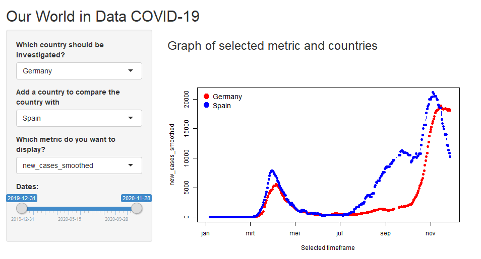

COVID-19 Shiny Application
========================================================
author: STVH19
date: 29-11-2020
autosize: true

Overview
========================================================

This presentation contains documentation for the COVID-19 Shiny Application developed for the Coursera Developing Data Products course.

This application enables to explore the Our World in Data COVID-19 dataset. The application allows the user to select:

- Country to investigate
- Country to compare the investigated country
- Metric from the dataset
- Timewindow

Our World in Data COVID-19 dataset
========================================================

The datasource used for the project is the Our World in Data COVID-19 dataset.You find the complete Our World in Data COVID-19 dataset—together with a complete overview of our sources and more—at the Our wolrd in Data GitHub repository [here](https://ourworldindata.org/coronavirus-source-data#testing-the-our-world-in-data-testing-database)

Our World in Data relies on data from the European CDC. The European CDC publishes daily statistics on the COVID-19 pandemic. Not just for Europe, but for the entire world. They rely on the ECDC as they collect and harmonize data from around the world which allows us to compare what is happening in different countries. The European CDC data provides a global perspective on the evolving pandemic (source: Our World in Data)

The displayed data is collect on November, 2019 and is not automatically updated.


Shiny application
========================================================
The application is build using the Shiny package in R. The source is available in two 2 files:

- ui.R
- server.R

Both files can be found here: 


Dataset summary
========================================================


```r
# Load data
filename <- 'owid-covid-data.csv'
covid_data <- read.csv(filename, sep =',')

# Transform input files
covid_data$date <- as.Date(covid_data$date, format = "%Y-%m-%d")
```

```
[1] "Data timeframe: 2019-12-31 - 2020-11-28"
```

```
[1] "Number of countries: 216"
```

```
[1] "Number of rows: 59759"
```

```
[1] "Number of columns: 50"
```

Application Overview
==========================================



